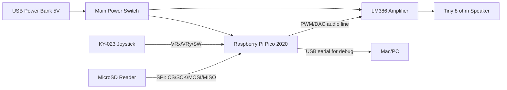

# Lootr Audio Synth / Sampler Project

## Project Overview

Lootr is an interactive audio prototype where joystick direction selects an item
category and joystick amplitude controls selection tightness/intensity. The
project currently has two active tracks:

- Python prototype for gameplay/selection logic iteration.
- Raspberry Pi Pico 2020 hardware diagnostics for SD-card stability.

Primary hardware target is now Raspberry Pi Pico 2020 (RP2040).

## Documentation

Structured project docs are in:

- `docs/README.md`
- `docs/TODO.md`
- `docs/local-testing.md`
- `docs/hardware-wiring.md`
- `docs/audio-options.md`

## Current Primary Target (Raspberry Pi Pico 2020)

Use the Pico SD diagnostics sketch:

- `raspberry_pi_pico_sd_diag/raspberry_pi_pico_sd_diag.ino`

This sketch continuously verifies SD initialization and file enumeration and is
the canonical hardware bring-up path.

### Pico Wiring (SD Reader)

Use GPIO labels (not just physical position descriptions):

| SD Reader Pin | Pico GPIO | Pico Physical Pin    |
| ------------- | --------- | -------------------- |
| CS            | GP17      | 22                   |
| SCK           | GP18      | 24                   |
| MOSI / DI     | GP19      | 25                   |
| MISO / DO     | GP16      | 21                   |
| GND           | GND       | 23                   |
| VCC           | 3V3 or 5V | 36 (3V3) / 40 (VBUS) |

Power notes:

- Start with 3V3 power.
- If init fails consistently, test 5V VBUS only if module supports it.
- Keep MISO/DO voltage within Pico-safe logic range.

### Pico Board Package Requirement

This sketch expects the Earle Philhower RP2040 core in Arduino IDE.

Board Manager URL:

```text
https://github.com/earlephilhower/arduino-pico/releases/download/global/package_rp2040_index.json
```

### Expected Serial Output

Working wiring/module behavior shows lines like:

```text
CS=17 -> SD.begin OK, files=112, raw=112
[PASS N] CS=17 files=112 raw=112
```

Failure shows:

```text
No working CS pin found.
[FAIL N] no active CS
```

## Joystick Bring-Up (Serial Only)

To verify joystick input without audio, use:

- `raspberry_pi_pico_joystick_diag/raspberry_pi_pico_joystick_diag.ino`

### Pico Wiring (KY-023)

| KY-023 Pin | Pico GPIO | Pico Physical Pin |
| ---------- | --------- | ----------------- |
| GND        | GND       | 23                |
| +5V        | 3V3       | 36                |
| VRx        | GP26      | 31                |
| VRy        | GP27      | 32                |
| SW         | GP15      | 20                |

Important:

- Power the joystick from Pico 3V3, not 5V.
- The button line is active LOW (`PRESSED` when grounded).

### Serial Test Steps

1. Upload joystick sketch.
2. Open Serial Monitor at 115200 baud.
3. Leave stick untouched for startup calibration.
4. Move stick and press button.

Expected stream:

```text
rawX=... rawY=... normX=... normY=... sw=released
rawX=... rawY=... normX=... normY=... sw=PRESSED
```

Commands in serial monitor:

- `c` recalibrates center (leave stick untouched)
- `h` prints help

## Setup & Running on Mac (Prototype)

1. Ensure Python 3 is installed.
2. Sync dependencies:

```bash
uv sync
```

3. Run prototype:

```bash
source .venv/bin/activate
python proto.py
```

## System Overview (Handheld Target)

The handheld build target keeps the current Pico + SD input path and adds
battery-powered audio output.



## Handheld Build TODO

### Electrical + Power

- [ ] Choose power source: USB power bank 5V output
- [ ] Add inline latching power switch on main 5V rail from power bank
- [ ] Confirm common ground between Pico, SD reader, joystick, and LM386
- [ ] Decide Pico power input path (VBUS pin from switched 5V rail)
- [ ] Add basic decoupling near LM386 and Pico power pins

### Audio Path

- [ ] Choose Pico audio output strategy (PWM + RC filter or external DAC board)
- [ ] Wire Pico audio output into LM386 input (with volume potentiometer)
- [ ] Add LM386 support components (gain/stability/output cap)
- [ ] Connect tiny speaker and verify clean audio at low/medium volume
- [ ] Check noise floor (USB/battery hiss, digital whine) and improve
      grounding/layout

### Firmware + Integration

- [ ] Merge SD + joystick diagnostics into one integration firmware target
- [ ] Add serial startup summary: SD pass/fail, joystick calibration, input
      activity
- [ ] Implement trigger-to-sample playback loop without requiring host
      connection
- [ ] Keep serial debug mode available via USB for field diagnostics

### Mechanical + UX

- [ ] Choose enclosure layout for thumb access, speaker vent, and SD access
- [ ] Strain-relief or secure jumper/headers to avoid intermittent contact
- [ ] Mount switch in externally reachable location
- [ ] Add battery-level/user status indication plan

### Validation Gates

- [ ] 10-minute burn-in on battery power with no resets
- [ ] Stable SD read pass during movement/handling
- [ ] Joystick input remains centered after repeated use
- [ ] Audible output meets minimum loudness without clipping

## Legacy Teensy Support

Teensy 4.0 PlatformIO firmware remains in this repo as legacy compatibility and
reference material. It is no longer the primary bring-up path.

Legacy files include:

- `platformio.ini` Teensy environments
- `src/main.cpp`, `src/main_hw_test.cpp`, `src/main_sd_diag.cpp`
- `scripts/flash_*` helpers that call `pio run -e teensy40...`

Use these only if you are intentionally targeting Teensy hardware.
